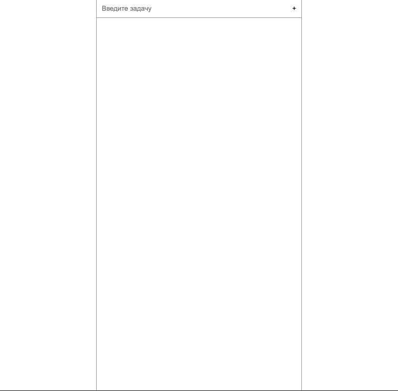

> # Тудушка с переносом

> ### Скачивание

```bash
> git clone git@github.com:vicimpa/DragTodo.git
> npm install
```

> ### Онлайн демо
> Перейти нужно [сюда](https://vicimpa.github.io/todo/index.html)

> ### Скриншоты
> 
> 
> 

> ### Запуск сборки
```bash
> npm run build

# или 

> make
```

> ### Запуск сервера с livereload
```bash
> npm start
```